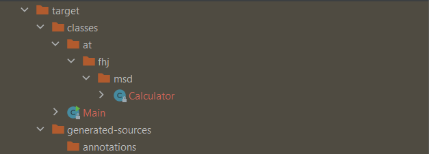
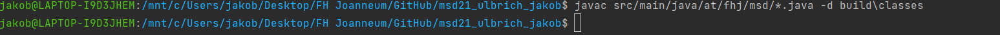

#steps for exercise 3 Maven and versioning

 ## Step 1: Setting things up
* **Install most recent Java version (JRE JDK)**
  * [JDK](https://openjdk.java.net/) also includes the most recent version of JRE
* **Install most recent LTS version of Maven and set environment variables**
  * use standard settings
### Installing things manually
> Since maven does not have an installer you hav to set the Path variable **manually**
> * open advanced system settings
> * go to environmental variables
> * go to system variables 
>    * add JAVA_HOME
>    * add MAVEN_HOME
>   * edit Path and add MAVEN_HOME
> * go to user variables
>    * edit Path and add JAVA_HOME and MAVEN_HOME

> to check your installs you can use the following
* mvn -v
  * shows you maven version, java version, home path etc.
* java -version
  * shows you java version and JRE version
* javac -version
  * shows you the version of the java compiler

## Step 2: Setting up a Maven project using an IDE (Intellij)
1. Create a new maven project and save it in your content root by selecting it as destination
2. track the new files by committing them

## Step 3: creating a package and  classes
1. go to src/main/java and create a new package by right clicking it and chosing package
2. navigate to the package, right click it and create new class Calculator
   * this class should contain methods that represent arithmetic operations (+,-,/,*)
3. right click the java folder and create new main class
   * call the methods from .Calculator in main
4. run the main class

## Step 4: target folder
after running the main class for the first time a new folder, called "target", will be generated


## Step 5: Build maven project
1. edit your pom.xml and add the following code<br>

```
<build>
        <plugins>
            <plugin>
                <groupId>org.apache.maven.plugins</groupId>
                <artifactId>maven-compiler-plugin</artifactId>
                <version>3.8.0</version>
                <configuration>
                    <release>17</release>
                </configuration>
            </plugin>
        </plugins>
</build>
```

2. Build your demo file by typing **mvn compile** in your console
3. run your code in the terminal by typing in the following<br>
*javac src/main/java/at/fhj/msd/*.java -d build\classes*


